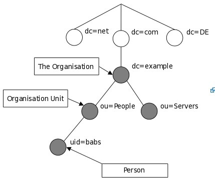
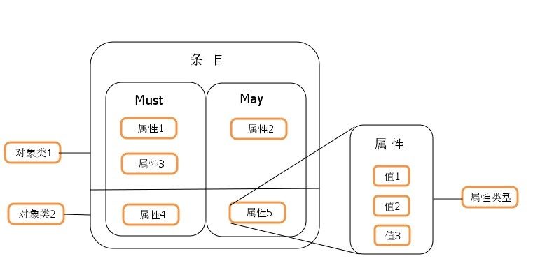

### LDAP Principle & Concept
- LDAP 解决什么问题：
  - 为了解决集中式的统一认证问题出现的认证协议
- LDAP（Light Directory Access Portocol），它是基于X.500标准的轻量级`目录访问协议`。
- 目录服务：
  - 是一个特殊的数据库，为`查询`、`浏览`和`搜索`而优化的数据库，成树状结构组织数据，类似文件目录一样。用来保存描述性的、基于属性的详细信息，支持过滤功能。
  - 具有动态，灵活，易扩展的属性。
  - 有优异的读性能，但写性能差，天然适用于`查多改少`的场景。
#### LDAP的基本模型
- 目录树(Entry Tree): 整个数据库(目录数据集)成树状组织数据，可以表示为一个目录树，树中每个节点为一条目。
  
- 条目(Entry)：就是一条完整记录，有唯一可识别名称(DN)
- 属性(Attribute)：一个属性由`一个属性类型`和`一个或多个属性值`组成。
- 属性类型(Attribute Type): 
  - 属性类型约定属性值的数据格式和语法类型（Syntax）
  - 也约定了属性值是否可以有多少个, 
  - 也规定了属性查询时的匹配规则、排序顺序、大小写敏感等。
- 常见属性(DC、UID、OU、CN、SN、DN、RDN)
  
  | KW | FullName | Description |
  |--- |----|---|
  | dc | Domain Component | 域名的部分，其格式是将完整的域名分成几部分，如域名为example.com变成dc=example,dc=com（一条记录的所属位置）|
  | uid | User ID | 用户ID honnkyou.zh (一条记录ID) |
  | ou | Organization Unit | 组织单位，组织单位可以包含其他各种对象（包括其他组织单元），如“oaTeam”（一条记录的所属组织）|
  | cn | Common Name | 公共名称，如“Thomas Johansson”（一条记录的名称）|
  | sn | Surname | 姓 |
  | dn | Distinguished Name | 识别名称 如“uid=honnkyou.zh,ou=oaTeam,dc=honnkyou,dc=org”，一条记录的位置（唯一）|
  | rdn | Relative dn | 相对识别名 类似于文件系统中的相对路径，它是与目录树结构无关的部分，如“uid=honnkyou.zh”或“cn= Thomas Johansson” | 
- 对象类(ObjectClass)：与某个实体类型对应的一组属性集合，
  - 条目可以`继承`多个对象类,这样必要属性就继承给了子类。
  - 对象类中定义了必要属性(Must or Required)和可选属性(May or Optional)。
  - 有三种类型： 结构类型(Structural)、抽象类型(Abstract)和辅助类型(Auxiliary)
    - 结构类型(Structural): 规定了对象实体的基本属性，每个条目`属于且仅属于一个`结构型对象类。
    - 抽象类型(Abstract): 可以是结构类型或其他抽象类型父类,是将对象属性中共性的部分组织在一起，称为其他类的`模板`，条目不能直接集成抽象型对象类。
    - 辅助类型(Auxiliary): 规定了对象实体的扩展属性。每个条目可以同时属于多个辅助型对象类。
- 模式(Schema)
  - 定义了条目的数据结构
  -  对象类（ObjectClass）、属性类型（AttributeType）、语法（Syntax）分别约定了条目、属性、值，所以这些构成了模式(Schema)
  -  模式中的每一个元素都有唯一的OID编号，如2.5.4.41.条目数据在导入时通常需要接受模式检查，它确保了目录中所有的条目数据结构都是一致的。
   
- ----
- 基本模式
  - 信息模式
    - 树状形式组织数据，基本数据单元是`条目`，条目由`属性`构成，属性中存储`属性值`
  - 命名模式
    - 即LDAP中的`条目定位方式`, 每个条目有唯一dn, 相当于文件系统中的绝对路径。
    - 又可以用相对rdn 定位条目
  - 功能模式
    - 共有4类10种操作：
      - 查询类： 搜索，比较
      - 更新类： 添加，修改，删除条目，修改条目名
      - 认证类： 绑定，解绑
      - 其他类： 放弃，扩展
    - 扩展为新增功能，提供一种标准的扩展框架。(修改密码，StartTLS扩展)
  - 安全模式
    - 主要通过`身份认证`，`安全通道`，`访问控制`来实现
#### 访问LDAP步骤
1. 连接到LDAP服务器(connect)；
2. 绑定到LDAP服务器(bind)；
3. 在LDAP服务器上执行所需的任何操作(operate)；
4. 释放LDAP服务器的连接(close)；
  ```bash
  $ldapconn = ldap_connect(“127.0.0.1");
  $ldapbind = ldap_bind($ldapconn, 'username', $ldappass);
  $searchRows= ldap_search($ldapconn, $basedn, "(cn=*)");
  $searchResult = ldap_get_entries($ldapconn, $searchRows);
  ldap_close($ldapconn);
   ```
---- 
### LDAP Install
- Yum
  ```bash
  # yum install openldap openldap-clients openldap-servers
  # service slapd start
  ```
- Docker
  ```bash
  # docker pull osixia/openldap:latest
  # docker pull osixia/phpldapadmin:latest

  # docker run -p 389:389 -p 636:636 --name myLdap \
    --env LDAP_ORGANISATION="Honnkyou Blog" \
    --env LDAP_DOMAIN="blog.honnkyou.org" \
    --env LDAP_ADMIN_PASSWORD="xxxx" \
    --detach osixia/openldap:latest
  # docker exec -it myLdap bash

  # slaptest
  # ldapsearch -x -H ldap://localhost -b dc=blog,dc=honnkyou,dc=org -D "cn=admin,dc=blog,dc=honnkyou,dc=org" -W
  ```
- Source
  ```bash
  # gunzip -c openldap-VERSION.tgz | tar xvfB -
  # cd openldap-VERSION
  
  # ./configure --help
  # ./configure 

  # make test
  # make
  # make install

  ```
### LDAP Configure
配置LDAP设定要使用`ldapmodify` `slapadd`修改配置文件，不要手动修改。手动修改使得md5校验值匹配不上，会造成更多的问题。
 1. Edit the configuration file
    > confirm the `olcDbDirectory` must exist prior
   ```bash
   # cat > etc/openldap/slapd.ldif <<EOF
   > dn: olcDatabase=mdb,cn=config
   > objectClass: olcDatabaseConfig
   > objectClass: olcMdbConfig
   > olcDatabase: mdb
   > OlcDbMaxSize: 1073741824
   > olcSuffix: dc=<MY-DOMAIN>,dc=<COM> # olcSuffix: dc=blog,   dc=honnkyou,dc=org
   > olcRootDN: cn=admin,dc=<MY-DOMAIN>,dc=<COM> # olcRootDN:    cn=admin,dc=blog,dc=honnkyou,dc=org
   > olcRootPW: secret
   > olcDbDirectory: /var/lib/ldap
   > olcDbIndex: objectClass eq
   > EOF
  ```

 2. Import the configuration database 
   ```bash
   # /sbin/slapadd -n 0 -F /etc/slapd.d -l /etc/openldap/slapd.ldif
   ```
 3. Start LDAP
   ```bash
   # slapd -F /etc/slapd.d

   # ldapsearch -x -b '' -s base '(objectclass=*)' namingContexts
   dn:
   namingContexts: dc=blog,dc=honnkyou,dc=org
   ```
1. Add initial entries to your directory.
  ```bash
  # cat > initial.ldif <<EOF
  > dn: dc=<MY-DOMAIN>,dc=<COM> # dn: dc=blog,dc=honnkyou,dc=org
  > objectclass: dcObject
  > objectclass: organization
  > o: <MY ORGANIZATION>        # o: Honnkyou Blog
  > dc: <MY-DOMAIN>             # dc: honnkyou
  > 
  > dn: cn=admin,dc=<MY-DOMAIN>,dc=<COM> # dn: cn=admin,dc=blog,dc=honnkyou,dc=org
  > objectclass: organizationalRole
  > cn: admin
  > EOF

  # ldapadd -x -D "cn=admin,dc=blog,dc=honnkyou,dc=org" -W -finitial.ldif

  # ldapsearch -x -b 'dc=blog,dc=honnkyou,dc=org' (objectclass=*)'

  ```

### LDAP Master-Slave Cluster Setting
----
### LDAP Ops
#### cmd: ldapsearch
- 1.搜索参数
  | param | description|
  | ---- | ---- |
  | base | 表示把基准DN作为搜索对象。eg: cn=zbq,ou=Ops,dc=blog,dc=honnkyou,dc=org 的基准DN是dc=blog,dc=honnkyou,dc=org |
  | one | 表示把基准DN的第一层作为搜索对象，如上个例子中的ou=Ops为搜索对象。|
  | sub |表示把基准DN及以下的整棵树都作为搜索对象。默认选项|
- 2.parameter
  | param | description |
  | ---- | ----|
  |-a deref|指定别名反向引用。请输入 never、always、search 或 find。如果不使用此参数，缺省为 never。|
  |-A|只检索属性的名称，而不检索属性的值。|
  |-b base dn|指定用作搜索起始点的专有名称。使用引号来指定该值，如："ou=Ops,dc=shuyun,dc=com".如果要搜索的服务器需要指定搜索起点，则必须使用此参数。否则此参数>是可选的。也可以同时使用 -b 和 -s 来确定搜索范围。没有 –s，-b 就会搜索指定为起始点的项以及该项的所有子项。|
  |-B|允许打印非 ASCII 值|
  |-D bind dn|指定服务器用于验证您的专有名称。名称必须与目录中的项相符，并且必须拥有搜索目录所需的权限。请使用引号来指定该名称，例如："cn=Manager,dc=shuyun,dc=com"。如果不使用此参数，则与服务器的连接是匿名的。如果服务器不允许匿名连接，则必须使用 -D。除了 -D，还必须使用 -w 参数来指定与专有名称相关联的口令。|
  |-f file|指定包含要使用的搜索过滤器的文件，如 -f 过滤器。请将每个搜索过滤器置于单独的一行。Ldapsearch 会对每一行执行一次搜索。可选择指定过滤模式。例如，指定 -f 过滤 "cn=%s"，并在文件的每一行中输入公用名称的值。|
  |-F sep|在属性名称和值之间打印 sep 而不是等号 (=)。例如，如果读取 ldapsearch 输出的工具希望使用其他的分隔符时，可以使用此参数。|
  |-h host name|指定要连接的服务器主机名，如 -h ldap.honnkyou.org。|
  |-l timelimit|指定完成搜索的时间限制（秒）。如果没有指定此参数或指定的限制为 0，那么搜索就没有时间限制。但是，ldapsearch 的等待时间决不会超过服务器上设置的搜索时间限制。|
  |-L|指定以 LDIF 格式输出。LDIF 格式使用冒号 (:) 而不是等号 (=) 作为属性描述符。LDIF 对一次性添加或修改大量目录项很有帮助。例如，可以将输出内容引入兼容 LDAP >的目录中。|
  |-M|将参考对象作为普通项进行管理，以使 ldapsearch 可返回参考项本身的属性，而不是所参考的项的属性。|
  |-n|显示如何执行搜索，但不实际执行搜索|
  |-p port|指定服务器使用的端口。如果没有使用此参数，缺省情况下 ldapsearch 使用 389 端口。|
  |-R|不自动遵循服务器返回的搜索引用。请注意，Netscape 目录服务器将术语 referrals 用于搜索引用。|
  |-s scope|指定使用 -b 参数时的搜索范围：<br>base -- 仅搜索 -b 参数指定的项 <br>onelevel -- 仅搜索 -b 参数指定项的直接子项，而不搜索该项本身 <br>subtree -- 搜索 -b 参数指定的项以及它的所有子项。<br> 这是不带 -s 时使用 -b 的缺省行为。指定 -b 和 -s 的顺序并不重要。|
  |-S attribute|按指定的属性排序结果。|
  |-z sizelimit|指定返回项的最大数目。如果没有指定此参数或指定的限制为 0，那么返回的项没有数量限制。但是，ldapsearch 返回的项决不会多于服务器允许的数量。|
  |-u|指定 ldapsearch 以用户友好格式返回专有名称。|
  |-v|指定 ldapsearch 以详尽模式运行。|
  |-w password|指定与 -D 参数一起使用的与专有名称关联的口令。|
  |x|与 -S 一起使用时可指定 LDAP 服务器在将结果返回之前就对它们进行排序。如果使用 -S 而不使用 –x，ldapsearch 将对结果排序。|
- 3.Filter<br>
   搜索过滤器用法：`'<attribute> <operator> <value>'`<br>
   可以使用多个搜索过滤器以及布尔运算符。<br>
   语法：`"(operator(filter)(filter))"` <br>
   布尔运算符可以嵌套 <br> eg: `"(&(maildomain=MDN)(|(sn=caneel)(givenname=alfred)))"`
  |Operator|Description|Example|
  |---- | ---- | ----|
  |=|查找所包含的属性值与指定值相同的项 |"cn=yanzong"|
  |>=|查找特定项，该项中包含的属性的数字或字母值大于或等于指定的值。|"cn>=D"|
  |<=|查找特定项，该项中包含的属性的数字或字母值小于或等于指定的值。|"roomNumber<=300"|
  |=*|查找包含特定属性的值的项，而不用管属性的值是什么。|"sn=*"|
  |~=|查找特定项，该项中所含属性的值约等于指定的值。|"sn~=Brning" 可能返回 sn=Browning|
  |&|查找与所有搜索过滤器中指定的条件相匹配的项|"(&(cn=John Browning)(l=Dallas))"|
  |\||查找与至少一个搜索过滤器中指定的条件相匹配的项|"(\|(cn=John Browning)(l=Dallas))"|
  |!|查找与任何搜索过滤器中指定的条件都不匹配的项|"(!(cn=John Browning)(l=Dallas))"|
  |= `<string>*<string>`|查找所包含的属性值与指定值相同的项(模糊匹配)|"cn=y*zong" "cn=yan*"|

- 4.Example
  | Command | Description |
  | ---- | ---- |
  |ldapsearch -h ldap.honnkyou.org "objectClass=*"|搜索所有项，并返回所有属性和值|
  |ldapsearch -A -h ldap.honnkyou.org" objectClass=*"|搜索所有项，返回属性名称|
  |ldapsearch -a always -h ldap.honnkyou.org "objectClass=*"|搜索所有项，并且反向引用找到的所有别名|
  |ldapsearch -h ldap.honnkyou.org "objectClass=*" mail cn sn givenname|搜索所有项，并返回 mail、cn、sn 和 givenname 等属性|
  |ldapsearch -b "ou=West,o=Acme,c=US" -h ldap.honnkyou.org "(cn=Mike*)"|以”ou=West，o=Acme，c=US” 为基准搜索 (cn=Mike*)，并返回所有属性和值|
  |ldapsearch -s onelevel -h ldap.acme.com "objectClass=*"|搜索一个级别，并返回所有属性和值|
  |ldapsearch -s base -h ldap.acme.com "objectClass=*"|同上，但限制基准的范围|
  |ldapsearch -l 5 -h ldap.honnkyou.org "objectClass=*"|搜索所有项，并返回所有的属性和值；搜索时间限制为五秒|
  |ldapsearch -z 5 -h ldap.honnkyou.org "objectClass=*"|搜索所有项，并返回所有的属性和值；大小限制为五|
  |ldapsearch -h ldap.honnkyou.org -D "cn=john doe,o=acme" -w password `-L` "objectClass=*"|搜索所有项，捆绑为：用户“cn=John Doe,o=Acme”，口令“password”，并以 `LDIF` 格式返回所有的属性和值|
  |ldapsearch -h ldap.honnkyou.org" -s base -b "cn=john doe,o=acme" objectClass=*"|对“cn=John Doe,o=Acme”项，返回其允许匿名查看的所有属性|
  |ldapsearch -h bluepages.ibm.com -p 391 "objectClass=*"|搜索另一台机器上的所有项|
  |ldapsearch -h bluepages.ibm.com -p 391 -b "o=ibm" -l 300 -z 1000 "(&(objectclass=Person)(\|(cn=jerry seinfeld*)(givenname=jerry seinfeld*)(sn=jerry seinfeld*)(mail=jerry seinfeld*)))" cn|从组织“o=ibm”开始,对还有与 OR 过滤器中任意一个属性相匹配的属性的任何“个人”对象类型进行子树搜索（缺省）。超时值为 300 秒，返回的最大项数设为 1000。且仅返回 DN（缺省）和 CN（这是 Web 应用程序的公用过滤器）|
  |ldapsearch -h bluepages.ibm.com -p 391 -b "cn=HR Group,ou=Asia,o=IBM" -s base -l 300 "(objectclass=*)" member|以基准项“cn=HR Group,ou=Asia,o=IBM”为起始，时间限制为 300 秒，查询此项的所有成员。（Web 应用程序中用以确定群组成员的另一个公用过滤器）|


#### cmd: ldapmodify
```text
ldapmodify [ldap 服务器地址] [你的用户名] [你的密码] [ldif 文件的地址]
```
- 1.Parameter
  | param | Description |
  | ---- | ---- |
  | -H | ldapurl ldap://<hostname>:<port> 不能与-h 和-p 同时使用 |
  | -h | IP or hostname, 与-p 可以结合使用 |
  | -p | port 与-h 可以结合使用 |
  | -x | 使用简单认证方式 |
  | -D | 绑定的DN |
  | -w | 绑定DN的密码，与-W二选一|
  | -W | 交互式输入密码|
  | -f | 指定ldif 文件作为输入|
  | -a | 添加新的entry，等同ldapadd, ldapadd缺省使用|
  | -c | 出错时忽略当前err继续执行，缺省为终止|
  | -n | test 模式，验证不执行，常与-v 一起定位问题|
  | -v | 详细信息 |
  | -d | debug信息，可设debug级别 |
  | -e | 设置client cert|
  | -E | 设置client private key |
- 2.Example
  - 2.1 Add a user. `AddcnUser.ldif`
  ```ldif
  dn: cn=barbara,dc=blog,dc=honnkyou,dc=org
  objectClass: inetOrgPerson
  cn: barbara
  sn: Jensen
  title: the world's most famous mythical manager
  mail: bjensen@example.com
  uid: bjensen
  ```

  ```bash
  # ldapadd -x -H ldap://localhost:389 -D "cn=admin,dc=blog,dc=honnkyou,dc=org" -W -f AddcnUser.ldif

  # ldapsearch -x -H ldap://localhost:389  -b dc=blog,dc=honnkyou,dc=org -D "cn=admin,dc=blog,dc=honnkyou,dc=org" -W 

  # ldapsearch -x -H ldap://localhost:389  -b dc=blog,dc=honnkyou,dc=org -D "cn=admin,dc=blog,dc=honnkyou,dc=org" -W "cn=*"

  # ldapdelete -x -H ldap://localhost:389  -D "cn=admin,dc=blog,dc=honnkyou,dc=org" -W  "cn=barbara,dc=blog,dc=honnkyou,dc=org"
  ```

  ```ldif
  dn: cn=barbara,dc=blog,dc=honnkyou,dc=org
  changetype: add
  objectClass: inetOrgPerson
  cn: barbara
  sn: Jensen
  title: the world's most famous mythical manager
  mail: bjensen@example.com
  uid: bjensen
  ```

  ```bash
  # ldapmodify -x -H ldap://localhost:389 -D "cn=admin,dc=blog,dc=honnkyou,dc=org" -W -f AddcnUser.ldif

  # ldapsearch -x -H ldap://localhost:389  -b dc=blog,dc=honnkyou,dc=org -D "cn=admin,dc=blog,dc=honnkyou,dc=org" -W 
  ```
  - 2.2 Add OU. `addOU.ldif`
  ```ldif
  dn: ou=People,dc=blog,dc=honnkyou,dc=org
  changetype: add
  objectclass: top
  objectclass: organizationalUnit
  ou: People

  dn: ou=Servers,dc=blog,dc=honnkyou,dc=org
  changetype: add
  objectclass: top
  objectclass: organizationalUnit
  ou: Servers
  ```

  ```bash
  # ldapmodify -x -H ldap://localhost:389 -D "cn=admin,dc=blog,dc=honnkyou,dc=org" -W -f addOU.ldif

  # ldapsearch -x -H ldap://localhost:389  -b dc=blog,dc=honnkyou,dc=org -D "cn=admin,dc=blog,dc=honnkyou,dc=org" -W 
  ```

  - 2.3 Replace title. `ReplaceTitle.ldif`
  ```ldif
  dn: cn=barbara,dc=blog,dc=honnkyou,dc=org
  changetype: modify
  replace: title
  title: one of the world's most famous mythical manager
  ```
  ```bash
  # ldapmodify -x -H ldap://localhost:389 -D "cn=admin,dc=blog,dc=honnkyou,dc=org" -W -f ReplaceTitle.ldif

  # ldapsearch -x -H ldap://localhost:389  -b dc=blog,dc=honnkyou,dc=org -D "cn=admin,dc=blog,dc=honnkyou,dc=org" -W 
  ```

  - 2.4 Add an attribute of description. `AddAttribute.ldif`
  ```ldif
  dn: cn=barbara,dc=blog,dc=honnkyou,dc=org
  changetype: modify
  add: description
  description: barbara description
  ```
  ```bash
  # ldapmodify -x -H ldap://localhost:389 -D "cn=admin,dc=blog,dc=honnkyou,dc=org" -W -f AddAttribute.ldif

  # ldapsearch -x -H ldap://localhost:389  -b dc=blog,dc=honnkyou,dc=org -D "cn=admin,dc=blog,dc=honnkyou,dc=org" -W 
  ```

  - 2.5 Move to OU. file name: MoveToOU.ldif
  ```ldif
  dn: cn=barbara,dc=blog,dc=honnkyou,dc=org
  changetype: modrdn
  newrdn: cn=babara
  deleteoldrdn: 0
  newsuperior: ou=People,dc=blog,dc=honnkyou,dc=org
  ```
  ```bash
  # ldapmodify -x -H ldap://localhost:389 -D "cn=admin,dc=blog,dc=honnkyou,dc=org" -W -f MoveToOU.ldif

  # ldapsearch -x -H ldap://localhost:389  -b ou=People,dc=blog,dc=honnkyou,dc=org -D "cn=admin,dc=blog,dc=honnkyou,dc=org" -W 
  ```
#### Change PW
`ldappasswd` 用于重置其他用户的密码

`ldapmodify` 用于更改自己的密码

```bash
### M1. Admin 修改other user's PW
# ldappasswd -x -H ldap://localhost:389 -D "cn=admin,dc=blog,dc=honnkyou,dc=org" -W  "cn=babara,ou=People,dc=blog,dc=honnkyou,dc=org"
 
### M2. 更改自己PW
# ldappasswd -x -H ldap://localhost:389 -D "cn=babara,ou=People,dc=blog,dc=honnkyou,dc=org" -w xxxx -s mima

# ldapsearch -x -H ldap://localhost -D 'cn=babara,ou=People,dc=blog,dc=honnkyou,dc=org' -w mima -b 'cn=babara,ou=People,dc=blog,dc=honnkyou,dc=org'
```

`passwd.ldif`
```ldif
dn: cn=babara,ou=Poeple,dc=blog,dc=honnkyou,dc=org
changetype: modify
replace: userPassword
userPassword: xinmima
```

```bash
### M3. 用ldapmodify 修改自己PW
# ldapmodify -x -H ldap://localhost:389 -D "cn=babara,ou=People,dc=blog,dc=honnkyou,dc=org" -w mima -f passwd.ldif 
```

### Reference
1. [OpenLDAP Software 2.4 Administrator's Guide](https://www.openldap.org/doc/admin24/)
2. [LDAP概念和原理介绍](https://www.cnblogs.com/wilburxu/p/9174353.html)
3. [我花了一个五一终于搞懂了 OpenLDAP](https://www.sohu.com/a/284300312_283613)
4. [完整版的OpenLDAP搭建全过程](https://www.cnblogs.com/lemon-le/p/6266921.html)
5. [A Quick-Start Guide](https://www.openldap.org/doc/admin24/quickstart.html)
6. [运维与LDAP（openldap）](https://blog.51cto.com/407711169/1439944)
7. [LDAP基础功能(重点为搜索:ldapsearch)](https://blog.51cto.com/407711169/1440931)
8. [Bilibili 上的openldap 教程](https://www.bilibili.com/video/BV1Pa4y1e7Ez)
9. [LDAP Docker on github: osixia/openldap](https://github.com/osixia/docker-openldap)